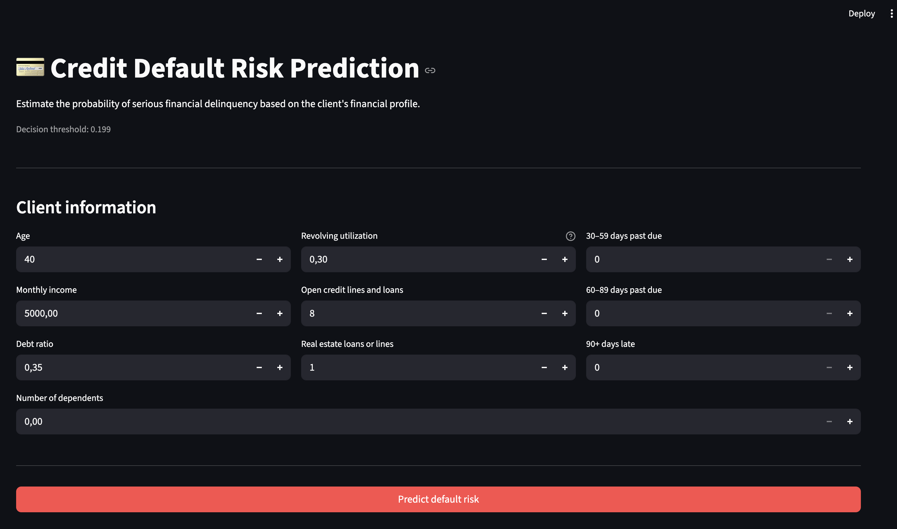
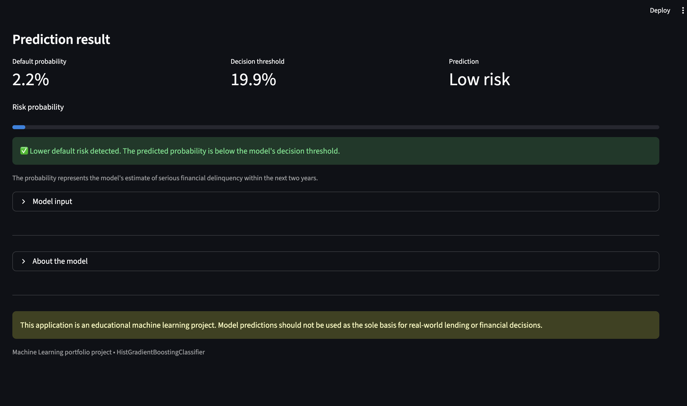

# 💳 Credit Default Risk Prediction
### 🚀 Live Demo

[Open the Streamlit application](https://creditdefaultriskprediction-rm9o7ylhdgrggsn7eesw2v.streamlit.app/)
An end-to-end machine learning project for predicting the probability of serious financial delinquency using client financial and credit history data.

The project covers the complete ML workflow: exploratory data analysis, data preprocessing, feature engineering, model comparison, threshold optimization, model interpretation, error analysis, and deployment through an interactive Streamlit application.

---

## 🎯 Project Objective

The goal of this project is to predict whether a client is likely to experience serious financial delinquency within the next two years.

This is an imbalanced binary classification problem where identifying high-risk clients is particularly important.

Instead of relying only on the default classification threshold of `0.5`, the decision threshold was optimized using a separate validation set.

---

## 🧠 Machine Learning Pipeline

The project includes:

- Exploratory Data Analysis (EDA)
- Missing value analysis and preprocessing
- Feature engineering
- Stratified train / validation / test split
- Logistic Regression baseline
- Random Forest
- HistGradientBoostingClassifier
- ROC-AUC and PR-AUC evaluation
- Decision threshold optimization
- Permutation feature importance
- Partial Dependence Plots
- False Positive / False Negative analysis
- Model serialization with Joblib
- Interactive Streamlit application

---

## 📊 Class Imbalance

The target variable is strongly imbalanced.

Approximately:

- **93.3%** — no serious delinquency
- **6.7%** — serious delinquency

Because of this imbalance, accuracy alone is not sufficient for evaluating model performance.

Special attention was given to:

- Precision
- Recall
- F1-score
- ROC-AUC
- PR-AUC

---

## 🤖 Model Comparison

Several classification approaches were evaluated.

### Logistic Regression

Logistic Regression was used as an interpretable baseline.

Threshold optimization improved the balance between precision and recall, with the best F1-score around:

`0.447`

### Random Forest

Random Forest achieved:

- ROC-AUC: approximately **0.850**
- PR-AUC: approximately **0.366**

A class-weighted version increased minority-class recall, but reduced PR-AUC.

### HistGradientBoostingClassifier

HistGradientBoostingClassifier produced the strongest overall ranking performance and was selected as the final model.

Final test performance:

| Metric | Score |
|---|---:|
| ROC-AUC | **0.868** |
| PR-AUC | **0.403** |
| Precision | **0.39** |
| Recall | **0.52** |
| F1-score | **0.45** |

---

## 🎚️ Decision Threshold Optimization

For an imbalanced classification problem, using the standard probability threshold of `0.5` can result in many high-risk clients being missed.

The classification threshold was therefore optimized on a separate validation dataset by maximizing the F1-score.

Selected threshold:

```text
0.199
```

The threshold was then frozen and applied to the untouched test set.

This prevents threshold selection from leaking information from the test dataset.

At the selected threshold, the final confusion matrix was:

```text
                 Predicted 0    Predicted 1

Actual 0            26398           1597
Actual 1              970           1035
```

The lower threshold substantially improves recall for the minority class while accepting more false positives.

---

## 🔍 Model Interpretation

Permutation importance was used to identify the features that have the largest impact on model performance.

The most influential features included:

1. `NumberOfTimes90DaysLate`
2. `RevolvingUtilizationOfUnsecuredLines`
3. `NumberOfTime30-59DaysPastDueNotWorse`
4. `NumberOfTime60-89DaysPastDueNotWorse`
5. `NumberOfOpenCreditLinesAndLoans`
6. `age`
7. `DebtRatio`

The strongest signals are therefore primarily associated with previous delinquency behavior and credit utilization.

Partial Dependence Plots were also used to examine how individual features are associated with model predictions.

---

## 🔬 Error Analysis

The final model produced:

| Prediction type | Count |
|---|---:|
| True Negative | 26,398 |
| True Positive | 1,035 |
| False Positive | 1,597 |
| False Negative | 970 |

False positives often showed elevated credit utilization or previous delinquency indicators.

False negatives demonstrate that some default cases do not exhibit the strongest risk signals available in the dataset.

This highlights the overlap between the two classes and the importance of treating model predictions as probabilistic risk estimates rather than deterministic decisions.

---

## ⚙️ Feature Engineering

In addition to the original financial variables, several derived indicators were created:

- `MonthlyIncome_missing`
- `NumberOfDependents_missing`
- `delinquency_special`
- `utilization_extreme`
- `MonthlyIncome_zero`

These features preserve information about missing values and unusual observations that may contain useful predictive signals.

---

## 🖥️ Streamlit Application



The trained model is integrated into an interactive Streamlit application.

The application allows a user to enter a client's financial characteristics and returns:

- predicted default probability
- optimized decision threshold
- risk classification
- model input information

Run the application locally:

```bash
streamlit run src/app.py
```

---

## 📁 Project Structure

```text
credit-default-risk-prediction/
│
├── assets/
│
├── data/
│   ├── cs-training.csv
│   └── cs-test.csv
│
├── models/
│   └── credit_risk_model.joblib
│
├── notebooks/
│   └── credit-scoring.ipynb
│
├── src/
│   └── app.py
│
├── .gitignore
├── README.md
└── requirements.txt
```

---

## 🚀 Installation

Clone the repository:

```bash
git clone <repository-url>
cd credit-default-risk-prediction
```

Install dependencies:

```bash
pip install -r requirements.txt
```

Run the Streamlit application:

```bash
streamlit run src/app.py
```

---

## 🛠️ Tech Stack

- Python
- Pandas
- NumPy
- Scikit-learn
- Matplotlib
- Joblib
- Streamlit
- Jupyter Notebook

---

## ⚠️ Disclaimer

This project was created for educational and portfolio purposes.

The model is not intended to be used as the sole basis for real-world lending or financial decisions.